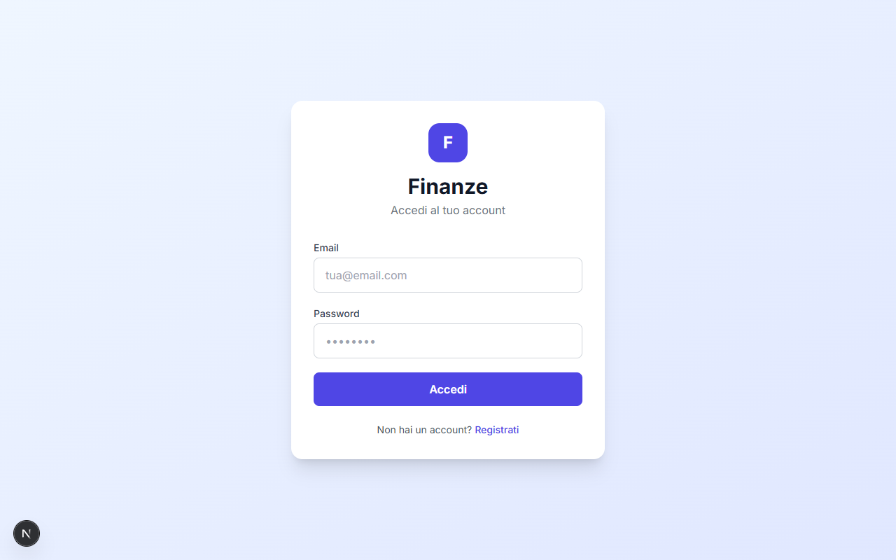
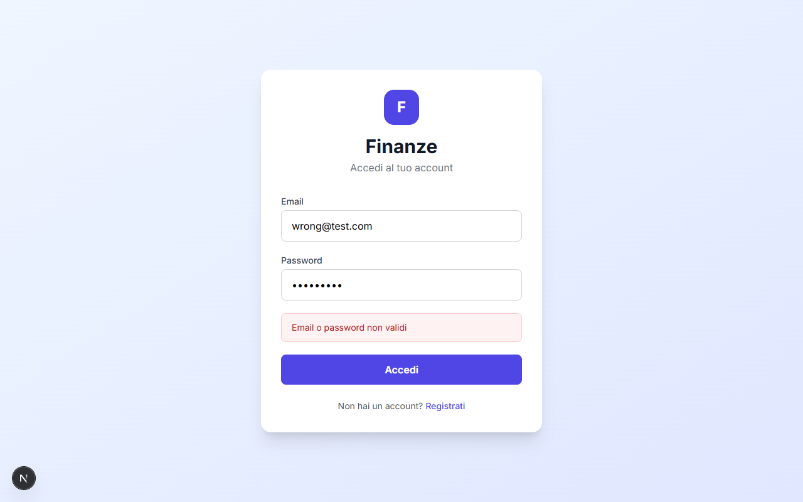
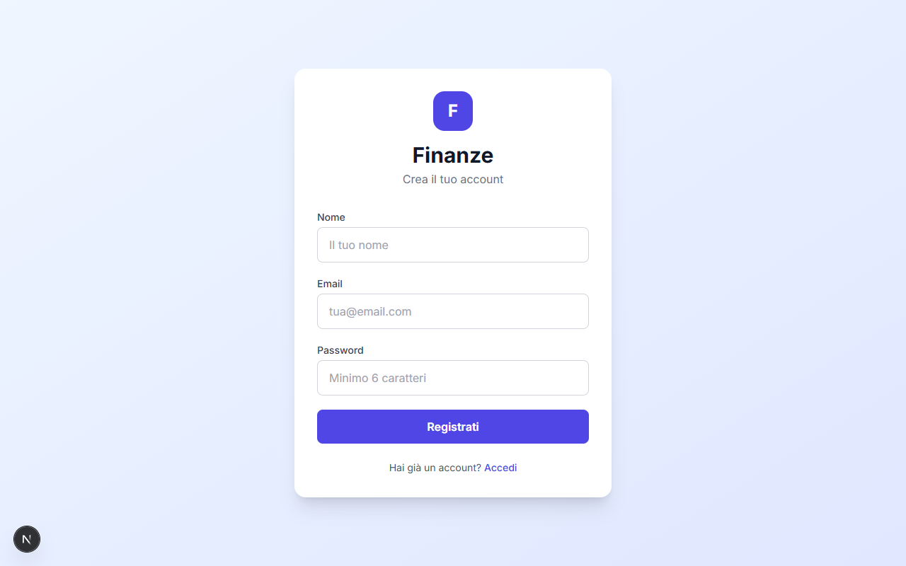
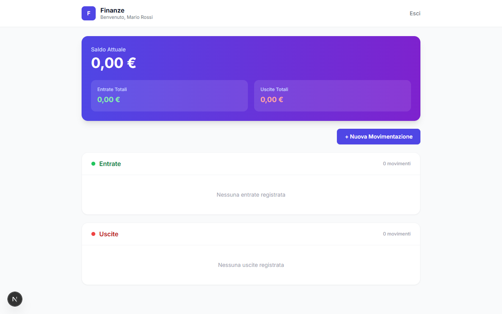
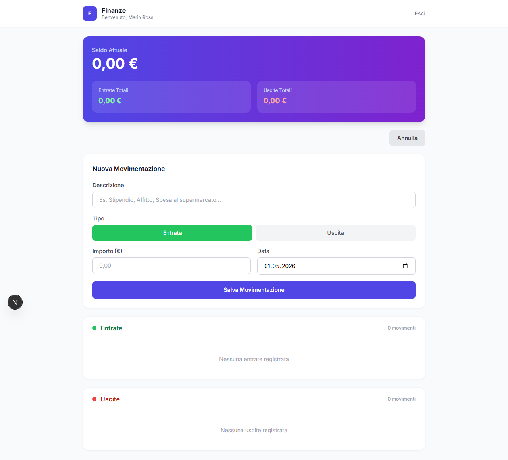

# Finanze — Personal Finance Control

A full-stack MVP web application for personal financial tracking built with **Next.js 16**, **React 18**, **Tailwind CSS**, and **Prisma + SQLite**.

---

## Features

- **User authentication** — register and log in with email and password
- **Protected dashboard** — only accessible to authenticated users
- **Balance card** — real-time balance calculated as `income − expenses`
- **Transaction management** — add income and expense entries with description, amount (€), and date
- **Separate lists** — income and expenses displayed in distinct, summarised lists
- **Visual feedback** — success and error messages on every action
- **Responsive design** — works on desktop and mobile

---

## Tech Stack

| Layer | Technology |
|---|---|
| Framework | Next.js 16 (App Router) |
| UI | React 18 + Tailwind CSS |
| Auth | NextAuth.js v4 (JWT + Credentials) |
| ORM | Prisma 5 |
| Database | SQLite (file-based, zero config) |
| Language | TypeScript |

---

## Screenshots

### Login
Clean login screen with email/password validation and link to registration.



---

### Login — Error State
Visual feedback when credentials are invalid.



---

### Registration
Sign-up form with name, email, and password fields. Password must be at least 6 characters.



---

### Dashboard — Empty State
After logging in, the user sees their name, a balance card (€ 0,00 initially), and two empty lists.



---

### Dashboard — New Transaction Form
Clicking "+ Nuova Movimentazione" reveals an inline form. Toggle between **Entrata** (income) and **Uscita** (expense), enter the amount in Euro, and pick a date (defaults to today).



---

### Dashboard — Form Filled
Example of a filled-in income transaction before saving.


---

## Project Structure

```
finanze-demo/
├── app/
│   ├── api/
│   │   ├── auth/[...nextauth]/route.ts   # NextAuth handler
│   │   ├── register/route.ts             # POST /api/register
│   │   └── transactions/route.ts         # GET + POST /api/transactions
│   ├── dashboard/page.tsx                # Main dashboard (protected)
│   ├── login/page.tsx                    # Login screen
│   ├── register/page.tsx                 # Registration screen
│   ├── layout.tsx                        # Root layout with SessionProvider
│   ├── providers.tsx                     # Client-side session wrapper
│   └── page.tsx                          # Root redirect (→ /login or /dashboard)
├── components/
│   ├── BalanceCard.tsx                   # Gradient balance summary card
│   ├── TransactionForm.tsx               # Add transaction form
│   └── TransactionList.tsx               # Filtered income / expense list
├── lib/
│   ├── auth.ts                           # NextAuth options & Credentials provider
│   └── prisma.ts                         # Prisma singleton client
├── prisma/
│   └── schema.prisma                     # User + Transaction models
├── types/
│   └── next-auth.d.ts                    # Session type augmentation
└── proxy.ts                              # Route guard for /dashboard
```

---

## Data Models

```prisma
model User {
  id           String        @id @default(cuid())
  email        String        @unique
  password     String        # bcrypt hashed
  name         String
  createdAt    DateTime      @default(now())
  transactions Transaction[]
}

model Transaction {
  id          String   @id @default(cuid())
  description String
  type        String   # "income" | "expense"
  amount      Float
  date        DateTime
  userId      String
  createdAt   DateTime @default(now())
}
```

---

## API Endpoints

| Method | Path | Auth | Description |
|---|---|---|---|
| `POST` | `/api/register` | Public | Create a new user account |
| `POST` | `/api/auth/callback/credentials` | Public | NextAuth login |
| `GET` | `/api/transactions` | Required | List user's transactions |
| `POST` | `/api/transactions` | Required | Create a new transaction |

---

## Getting Started

### Prerequisites
- Node.js 18+
- npm

### Installation

```bash
# 1. Install dependencies
npm install

# 2. Push the database schema (creates dev.db automatically)
npm run db:push

# 3. Start the development server
npm run dev
```

Open [http://localhost:3000](http://localhost:3000) — you will be redirected to the login page.

### Environment Variables

The `.env` file is pre-configured for local development:

```env
DATABASE_URL="file:./dev.db"
NEXTAUTH_SECRET="finanze-mvp-secret-change-in-production"
NEXTAUTH_URL="http://localhost:3000"
```

> For production, replace `NEXTAUTH_SECRET` with a strong random string and set `NEXTAUTH_URL` to your deployed domain.

---

## Validation Rules

| Field | Rule |
|---|---|
| Email | Must be a valid email address |
| Password | Minimum 6 characters |
| Amount | Must be greater than zero |
| Description | Required, max 200 characters |
| Duplicate email | Rejected at registration |

---

## Available Scripts

```bash
npm run dev        # Start development server (Turbopack)
npm run build      # Build for production
npm run start      # Start production server
npm run db:push    # Sync Prisma schema → database
npm run db:studio  # Open Prisma Studio (visual DB browser)
```
